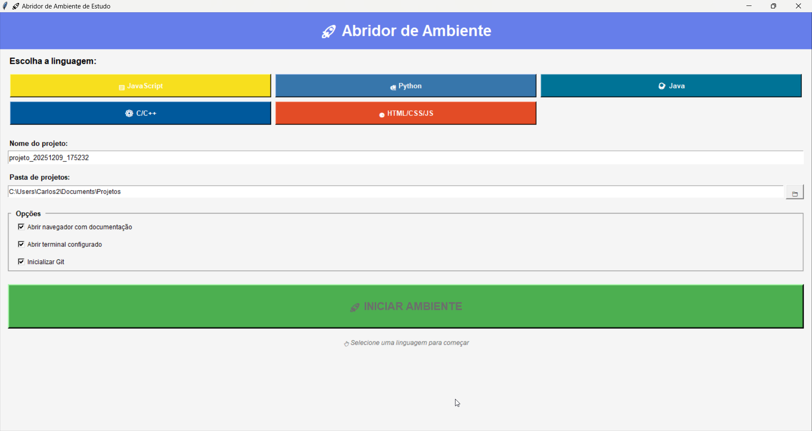

# 🚀 Abridor Automático de Ambiente de Estudo

<div align="center">



**Automatize seu ambiente de desenvolvimento com um clique!**

[](https://www.python.org/)
[](LICENSE)
[]()
[]()

[Funcionalidades](#-funcionalidades) • [Instalação](#-instalação) • [Como Usar](#-como-usar) • [Linguagens Suportadas](#-linguagens-suportadas) • [Customização](#-customização)

</div>

---

## 📖 Sobre o Projeto

O **Abridor de Ambiente** é uma ferramenta que automatiza completamente a inicialização do seu ambiente de desenvolvimento. Com apenas alguns cliques, você pode:

- ✅ Criar a estrutura completa do projeto
- ✅ Abrir o VS Code configurado
- ✅ Iniciar o navegador com documentação
- ✅ Configurar o terminal automaticamente
- ✅ Criar ambiente virtual Python (quando necessário)
- ✅ Inicializar repositório Git

**Economize minutos preciosos** em cada novo projeto e foque no que realmente importa: **programar!** 💻

---

## ✨ Funcionalidades

### 🎯 Interface Intuitiva
- Design moderno e responsivo
- Seleção visual de linguagens
- Configurações personalizáveis
- Feedback em tempo real

### 📁 Gerenciamento de Projetos
- Criação automática de estrutura de pastas
- Templates pré-configurados para cada linguagem
- README.md gerado automaticamente
- Inicialização Git opcional

### 🛠️ Ferramentas Integradas
- Abertura automática do VS Code
- Instalação de extensões recomendadas
- Terminal pré-configurado com comandos
- Ambiente virtual Python (venv)

### 🌐 Documentação Rápida
- Abre automaticamente a documentação oficial
- Links para recursos úteis (NPM, PyPI, etc.)
- Acesso rápido a tutoriais e guias

---

## 🎨 Linguagens Suportadas

<table>
  <tr>
    <td align="center">
      <br>
      <b>JavaScript</b><br>
      Node.js + NPM
    </td>
    <td align="center">
      <br>
      <b>Python</b><br>
      Virtual Env + Pip
    </td>
    <td align="center">
      <br>
      <b>Java</b><br>
      JDK + Javac
    </td>
  </tr>
  <tr>
    <td align="center">
      <br>
      <b>C/C++</b><br>
      GCC + Makefile
    </td>
    <td align="center">
      <br>
      <b>HTML/CSS/JS</b><br>
      Web Development
    </td>
    <td align="center">
      <br>
      <b>Personalizável</b><br>
      Adicione suas linguagens!
    </td>
  </tr>
</table>

---

## 📦 Instalação

### Pré-requisitos

- Python 3.7 ou superior
- VS Code (opcional, mas recomendado)
- Git (opcional)

### Método 1: Executar o Script Python

```bash
# Clone o repositório
git clone https://github.com/CarlosLacerda/abridor-ambiente.git

# Entre na pasta
cd abridor-ambiente

# Execute o programa
python abridor_ambiente.py
```

### Método 2: Executável Windows (.exe)

1. Baixe o executável na página de [Releases](https://github.com/CarlosLacerda/abridor-ambiente/releases)
2. Execute `AbrirAmbiente.exe`
3. Pronto! 🎉

### Método 3: Compilar seu próprio executável

```bash
# Instale o PyInstaller
pip install pyinstaller

# Execute o script de compilação
python criar_executavel.py

# Ou compile manualmente
pyinstaller --onefile --windowed --name=AbrirAmbiente abridor_ambiente.py
```

---

## 🚀 Como Usar

### Passo a Passo

1. **Escolha a linguagem** 🎯
   - Clique no botão da linguagem desejada

2. **Configure o projeto** ⚙️
   - Digite o nome do projeto (ou use o padrão)
   - Escolha a pasta onde será criado
   - Marque/desmarque as opções conforme preferir

3. **Inicie o ambiente** 🚀
   - Clique no botão verde "INICIAR AMBIENTE"
   - Aguarde a mágica acontecer!

4. **Comece a programar!** 💻
   - VS Code já estará aberto
   - Terminal configurado
   - Documentação no navegador

### Opções Disponíveis

- ✅ **Abrir navegador com documentação**: Abre as URLs relevantes automaticamente
- ✅ **Abrir terminal configurado**: Inicia o terminal na pasta do projeto
- ✅ **Inicializar Git**: Executa `git init` no projeto

---

## 🎯 Exemplos de Uso

### Projeto JavaScript/Node.js
```
📁 MeuProjetoJS/
├── index.html
├── script.js
├── style.css
├── README.md
└── .git/
```
**Abre automaticamente:**
- VS Code
- Terminal com `node --version`
- MDN JavaScript, NPM, GitHub

---

### Projeto Python
```
📁 MeuProjetoPython/
├── main.py
├── requirements.txt
├── venv/ (ambiente virtual)
├── README.md
└── .gitignore
```
**Abre automaticamente:**
- VS Code com extensão Python
- Terminal com venv ativado
- Docs Python, PyPI

---

### Projeto Web (HTML/CSS/JS)
```
📁 MeuSite/
├── index.html
├── style.css
├── script.js
└── README.md
```
**Abre automaticamente:**
- VS Code
- MDN Web Docs, W3Schools

---

## ⚙️ Customização

### Adicionar Nova Linguagem

Edite o dicionário `LANGUAGES` no arquivo `abridor_ambiente.py`:

```python
"Go": {
    "color": "#00ADD8",
    "icon": "🔵",
    "files": {
        "main.go": '''package main

import "fmt"

func main() {
    fmt.Println("Hello, Go!")
}
'''
    },
    "urls": [
        "https://go.dev/doc/",
        "https://pkg.go.dev/"
    ],
    "terminal_commands": ["go version"],
    "extensions": ["golang.go"]
}
```

### Personalizar Templates

Modifique os templates de arquivos em `LANGUAGES[linguagem]["files"]` para criar seus próprios snippets iniciais.

### Alterar Caminho do VS Code

No início do arquivo, configure:

```python
CONFIG = {
    "vscode_path": r"C:\Caminho\Completo\Code.exe",
    "base_projects_dir": r"C:\MeusProjetos",
}
```

---

## 🛠️ Tecnologias Utilizadas

- **Python 3.7+** - Linguagem principal
- **Tkinter** - Interface gráfica
- **subprocess** - Execução de comandos
- **webbrowser** - Abertura de URLs
- **pathlib** - Manipulação de caminhos

---

## 📸 Screenshots

### Tela Inicial


### Selecionando Linguagem
*Screenshot mostrando linguagem selecionada*

### Ambiente Criado
*Screenshot mostrando VS Code, terminal e navegador abertos*

---

## 🤝 Contribuindo

Contribuições são sempre bem-vindas! Para contribuir:

1. Faça um Fork do projeto
2. Crie uma branch para sua feature (`git checkout -b feature/NovaLinguagem`)
3. Commit suas mudanças (`git commit -m 'Adiciona suporte para Go'`)
4. Push para a branch (`git push origin feature/NovaLinguagem`)
5. Abra um Pull Request

### Ideias para Contribuições

- [ ] Adicionar mais linguagens (Go, Rust, PHP, Ruby, etc.)
- [ ] Suporte para Linux e macOS
- [ ] Integração com Docker
- [ ] Templates personalizados por usuário
- [ ] Histórico de projetos criados
- [ ] Criar repositório GitHub automaticamente
- [ ] Suporte a outras IDEs (IntelliJ, PyCharm, etc.)

---

## 📝 Roadmap

### Versão 2.0 (Em desenvolvimento)
- [ ] Suporte multiplataforma (Linux/macOS)
- [ ] Salvamento de configurações
- [ ] Histórico de projetos
- [ ] Templates compartilháveis
- [ ] Integração com GitHub CLI

### Versão 3.0 (Planejado)
- [ ] Plugin para VS Code
- [ ] Marketplace de templates
- [ ] Sincronização em nuvem
- [ ] Colaboração em tempo real

---

## ❓ FAQ

**P: Funciona no Linux/Mac?**  
R: Atualmente apenas Windows. Suporte para Linux/Mac está planejado para v2.0.

**P: Preciso ter o VS Code instalado?**  
R: Não é obrigatório, mas é altamente recomendado. O programa continuará funcionando sem ele.

**P: Como adiciono minha própria linguagem?**  
R: Veja a seção [Customização](#%EF%B8%8F-customização).

**P: O executável é seguro?**  
R: Sim! Você pode compilar o seu próprio com o código-fonte disponível.

**P: Posso usar em ambientes corporativos?**  
R: Sim, o projeto é licenciado sob MIT. Use livremente!

---

## 📄 Licença

Este projeto está sob a licença MIT. Veja o arquivo [LICENSE](LICENSE) para mais detalhes.

---

## 👨‍💻 Autor

**Carlos** 

- GitHub: [@CarlosLacerda](https://github.com/CarlosLacerda)
- LinkedIn: [Carlos Lacerda](https://www.linkedin.com/in/carlos-lacerda-972652394/)
- Email: 

---

## 🌟 Agradecimentos

- Inspirado pela necessidade de acelerar o workflow de desenvolvimento
- Feito com ❤️ para a comunidade de desenvolvedores
- Agradecimentos especiais a todos os contribuidores

---

## 💡 Inspiração

Este projeto nasceu da frustração de perder tempo configurando o mesmo ambiente repetidamente. Se você também já perdeu 10 minutos criando pastas, abrindo VS Code, procurando documentação... este projeto é para você! 🚀

---

<div align="center">

**Se este projeto te ajudou, considere dar uma ⭐!**

Made with 💻 and ☕ by Carlos

</div>
